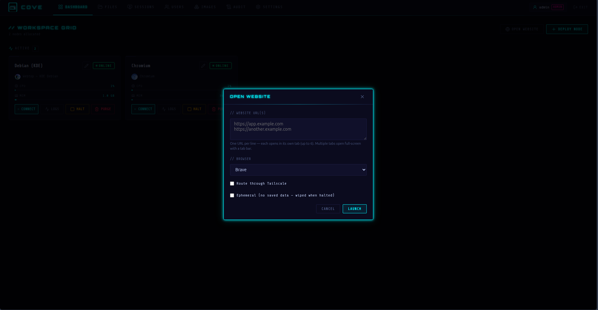
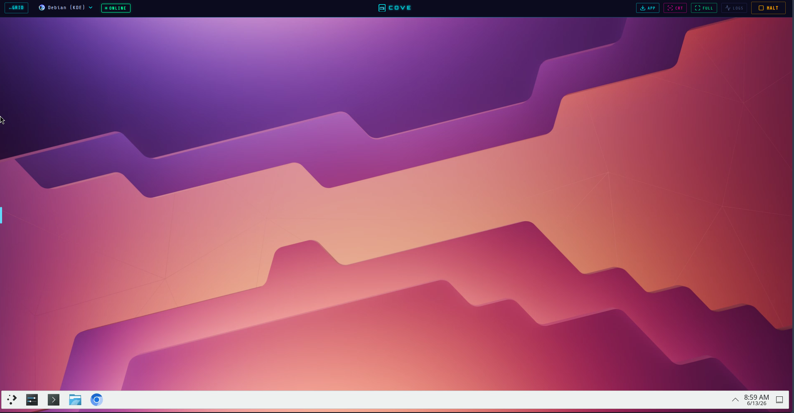
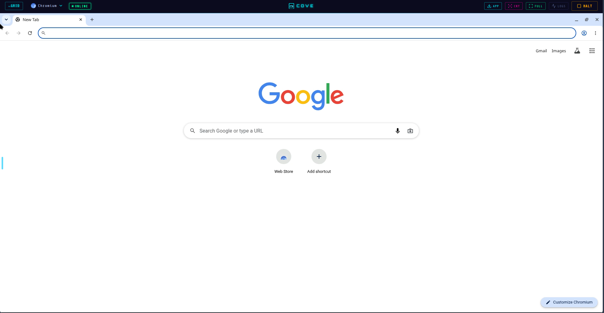
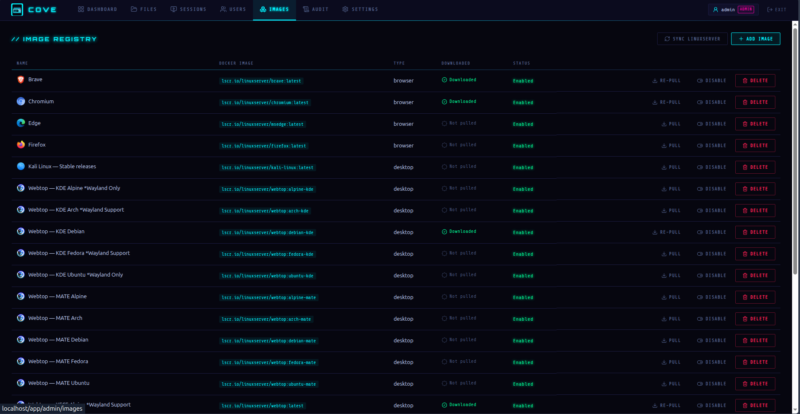

<div align="center">
  
  <h1>Cove</h1>
  <p><strong>Ephemeral desktop & browser containers for your home lab.</strong></p>
  <p>
    A self-hosted, Kasm-style VDI built on
    <a href="https://docs.linuxserver.io/images/docker-webtop/">LinuxServer.io</a>
    webtop images and streamed to the browser via Selkies — fronted by Traefik
    with per-workspace network isolation.
  </p>
  <p>
    
    
    
    
  </p>
</div>

<p align="center">
  
</p>

---

Cove lets you spin up full Linux desktops (XFCE, KDE, MATE, i3 on
Ubuntu/Debian/Arch/Fedora/Alpine), security desktops (Kali), and single-app
browsers (Chromium, Brave, Firefox) **on demand** — then open them in any browser
tab, with no client to install. It's built for home labs: simple to run, low
overhead, multi-user.

**[Quick start](#quick-start) · [Features](#features) · [Architecture](#architecture) · [Setup guide](SETUP.md) · [Architecture deep-dive](ARCH.md)**

## Screenshots

<table>
  <tr>
    <td width="33%" align="center">
      <br />
      <sub><b>Desktops</b> — full XFCE/KDE/MATE/i3 sessions in a tab</sub>
    </td>
    <td width="33%" align="center">
      <br />
      <sub><b>Browsers</b> — kiosk-style Chromium/Brave/Firefox</sub>
    </td>
    <td width="33%" align="center">
      <br />
      <sub><b>Image registry</b> — auto-populated catalog, one-click pulls</sub>
    </td>
  </tr>
</table>

## Features

### 🖥️ Workspaces

- **One-click launch** — spin up a desktop or browser container and stream it straight to your browser.
- **Open-a-website flow** — paste a URL, pick a browser, and Cove boots a kiosk-style browser pointed at it (web-app delivery), with optional dark mode and menu/full-screen variants.
- **In-stream controls** — fullscreen, a CRT toggle, HALT, and a **quick-switch menu** to jump between (or boot) other nodes without leaving the stream.
- **Live dashboard** — workspaces split into Active/Offline, with per-container **CPU & memory** on running cards and the **Tailscale IP** shown (and copyable) for tailnet nodes.
- **Per-workspace apps** — install distro packages (`universal-package-install`), LinuxServer **proot-apps**, and **AppImages** (auto-extracted with a desktop launcher) at launch.
- **Fresh containers** — halting a workspace removes its container; bringing it back always pulls the latest image.
- **Persistent storage** — per-workspace home directories that survive restarts (or go fully ephemeral, wiped on halt).

### 🌐 Networking & privacy

- **Per-user Tailscale routing** — opt a workspace into a per-workspace [Tailscale](https://tailscale.com/) sidecar using your own preauth key, with exit-node selection, accept-routes/DNS, and a custom control server.
- **Per-user VPN via Gluetun** — route a workspace's egress through a per-workspace [Gluetun](https://github.com/qdm12/gluetun) sidecar. Upload an OpenVPN/WireGuard config (stored encrypted), optionally override the WireGuard key or OpenVPN credentials; one active VPN at a time.
- **Custom DNS** — point a (non-VPN) workspace at public resolvers (e.g. `1.1.1.1`, `9.9.9.9`) instead of local DNS.
- **Egress policy** — workspaces are WAN-only by default. Docker-internal and cloud-metadata ranges are *always* blocked (so workspaces can never reach the Cove backend, the socket proxy, or each other); admins can allow specific LAN subnets that a workspace opts into per launch. Tailscale workspaces keep tailnet/subnet/exit-node access while raw-bridge egress stays firewalled.
- **Optional subdomain isolation** — set `COVE_WORKSPACE_DOMAIN` to stream each workspace from its own origin (`{id}.domain`) so it can't reach the SPA's token; unset falls back to subpath routing.

### 🛡️ Security

- **Authentication** — local accounts (bcrypt) *and* OIDC/Authentik SSO, with an optional **OIDC-only** mode that disables local login. Password management is hidden for SSO accounts.
- **Defense in depth** — ForwardAuth-gated streams, per-workspace isolated Docker networks, split read-only/write Docker socket proxies, verified OIDC tokens, dropped capabilities, short-lived JWTs with refresh, real-client-IP rate limiting, audit logging, and optional at-rest DB encryption.

### ⚙️ Admin & catalog

- **Auto-populated catalog** — images are pulled from the [LinuxServer.io API](https://docs.linuxserver.io/API/) on first run and via one-click admin sync; logos auto-fetched.
- **Manual image pulls** — pull/re-pull catalog images from the admin UI with live download status; delete the local image only, or the catalog entry too.
- **Resource limits** — admin-set default **CPU (cores)** and **memory (MB)** caps applied to workspace containers (0 = unlimited).
- **Admin settings** — pin/override the Tailscale and Gluetun sidecar images, toggle LAN access, force-disable sudo, set max runtime and CPU/memory limits, plus a read-only summary of env-configured settings.
- **Admin UI** — manage users, images, live sessions, and the audit log.

### ✨ Experience

- **File browser** — browse, upload, download, and delete files in your workspace storage areas.
- **User preferences** — a self-service page to change your password and manage Tailscale settings.
- **Installable PWA** — add Cove to your home screen / desktop; offline-aware app shell (the live stream and API are never cached).
- **Cyberpunk UI** — neon theme with an optional CRT toggle on the stream.

## Quick start

```bash
git clone <your-fork-url> cove && cd cove
cp .env.example .env
docker compose up --build -d
```

Open <http://localhost>, complete first-run admin setup, and launch a workspace.
Full instructions — including HTTPS, OIDC, DNS-01, and storage — are in
**[SETUP.md](SETUP.md)**.

## Architecture

```
                         ┌────────────────────────────────────────┐
  browser ──HTTP/S──▶ Traefik ──▶ cove (FastAPI + Vue SPA)         │
                         │  └─ForwardAuth─▶ /api/auth/forward       │
                         │                                          │
                         ├──▶ workspace container (webtop/browser)  │  each on its own
                         │      isolated network, port 3000         │  cove-ws-net-<id>
                         │                                          │
   cove ──┐              └──▶ docker-socket-proxy ──▶ /var/run/docker.sock (filtered)
          └─ manages containers via the proxy (DOCKER_HOST)
```

- **Backend** — Python 3.12, FastAPI, SQLAlchemy (SQLite/WAL), Docker SDK.
- **Frontend** — Vue 3 + TypeScript + Vite + Pinia.
- **Proxy** — Traefik v3 (label-based, auto-routes each workspace; TLS via Let's Encrypt, TLS-ALPN or DNS-01).
- **Workspaces** — `lscr.io/linuxserver/*` images (port 3000, `/config`).

A full breakdown — runtime topology, auth/stream flows, the workspace lifecycle,
and the data model — is in **[ARCH.md](ARCH.md)**.

## Testing

```bash
# Backend (from backend/, in a venv): ruff + pytest
ruff check server && pytest -q

# Frontend (from frontend/): typecheck + Vitest
npx vue-tsc --noEmit && npm test
```

CI runs lint, both test suites, a frontend build, and a Docker image build (see `.gitlab-ci.yml`).

## Built on / acknowledgements

Cove is glue around excellent open-source projects — all credit to their authors and maintainers:

- **[LinuxServer.io](https://www.linuxserver.io/)** ([images](https://docs.linuxserver.io/)) — the webtop/desktop & browser container images, the `universal-package-install` Docker mod, and [proot-apps](https://github.com/linuxserver/proot-apps). Workspaces stream via **[Selkies](https://github.com/selkies-project/selkies)** (the LinuxServer images Cove ships are all Selkies-based; **[KasmVNC](https://github.com/kasmtech/KasmVNC)** images also work).
- **[Tailscale](https://tailscale.com/)** ([tailscale/tailscale](https://github.com/tailscale/tailscale)) — the per-workspace tailnet routing sidecar.
- **[Gluetun](https://github.com/qdm12/gluetun)** by Quentin McGaw ([@qdm12](https://github.com/qdm12)) — the per-workspace VPN (OpenVPN/WireGuard) sidecar.
- **[Traefik](https://traefik.io/)** (Traefik Labs) — reverse proxy, ForwardAuth, and ACME/Let's Encrypt TLS.
- **[tecnativa/docker-socket-proxy](https://github.com/Tecnativa/docker-socket-proxy)** — the filtered Docker API proxy.
- **[netshoot](https://github.com/nicolaka/netshoot)** by Nicola Kabar — the short-lived helper used to apply per-workspace egress firewall rules.
- **WireGuard** is a registered trademark of Jason A. Donenfeld.
- Built with **[FastAPI](https://fastapi.tiangolo.com/)**, **[SQLAlchemy](https://www.sqlalchemy.org/)**, **[Vue](https://vuejs.org/)**, **[Vite](https://vite.dev/)**, **[Pinia](https://pinia.vuejs.org/)**, and **[lucide](https://lucide.dev/)** icons.

These projects are independent of Cove and are not affiliated with it; trademarks belong to their respective owners.

## A note on AI assistance

Cove was built with substantial help from AI coding tools (Claude). AI was used
for writing, refactoring, and reviewing code throughout the project. Every change
is human-reviewed before it lands, but you should evaluate the code on its own
merits — read it, test it, and decide whether it fits your needs before relying
on it. Contributions are welcome regardless of how they're authored.

## License

Cove is licensed under the **GNU General Public License v3.0** — see [LICENSE](LICENSE).
This follows the licensing of the upstream [LinuxServer.io](https://www.linuxserver.io/)
images Cove builds on. LinuxServer.io is not affiliated with this project.
</content>
</invoke>
